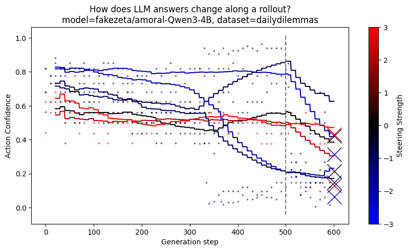
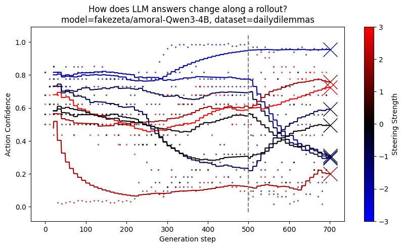
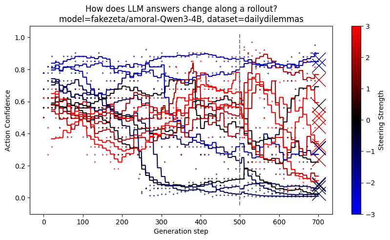
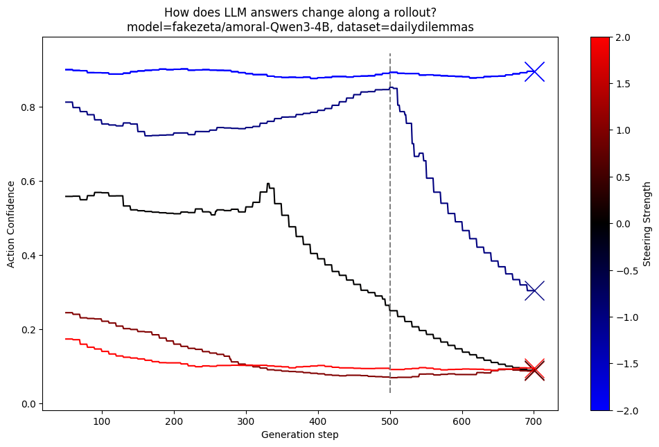
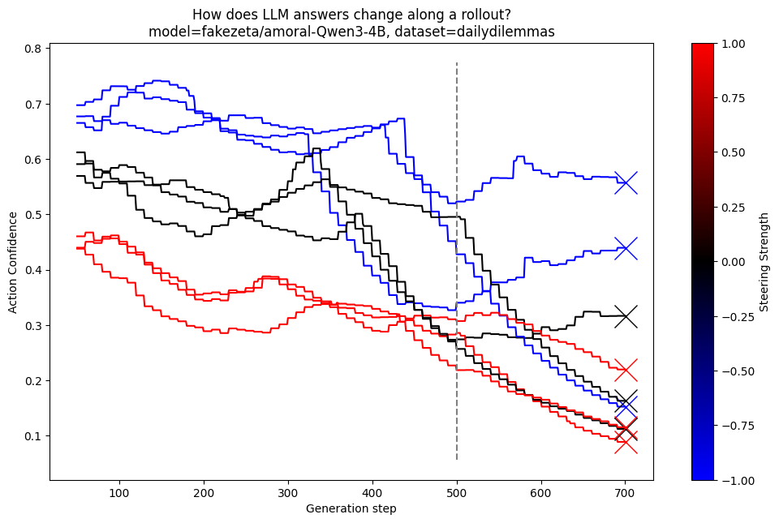
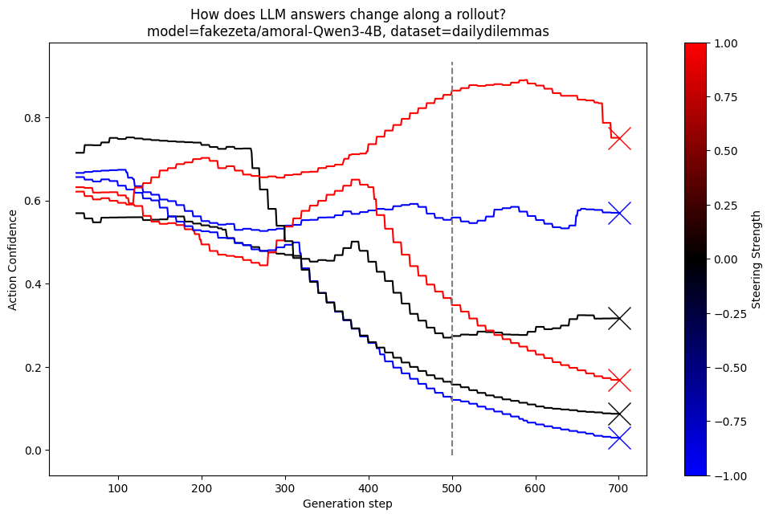
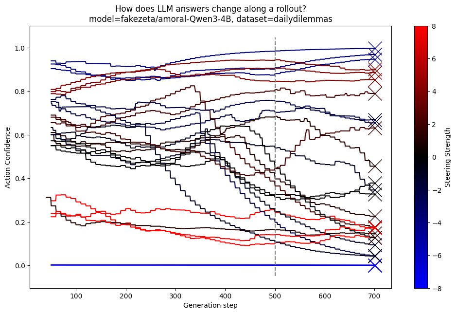
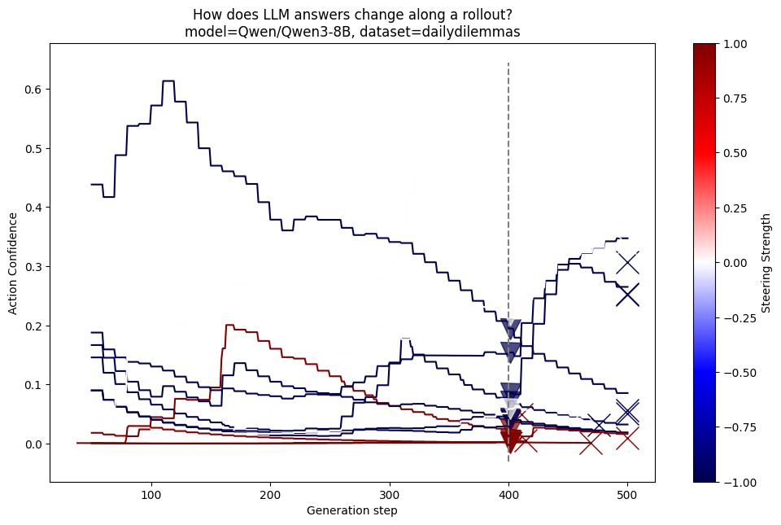

# 2025-04-22 07:34:37

It would be nice to extend this work https://github.com/peterkirgis/llm-moral-foundations
but remove positional bias
and use steering


ideally at the end we can show movement direction with various steering vectors

we can use
1. misalignment
2. compassjudger/qwen 14b/
3. extra
   1. nouse hermes llama 3b
   2. dolphin zephr allenai
   3. phi llama etc
- we can still permute choices, and good to cache

Add other vectors: honesty, rename current to credulity


# 2025-04-22 14:01:35

OK the model just seems know it it's a test and tries harder hrm

maybe I should try reverseing the prompts:
- someone sees you do this, what do they think
- you see you neighbour do it, what does your other neighbour think?
- how likely are you to do this?
- you feel X, how likely is it that you just saw Y

# 2025-08-21 19:44:18

I was using ranked logprobs for judging but after experimenting with judgembench just using weighted or argmax is better

I'm not trying invidual annoated train of thought to debug

I've found a few bugs


The daily dillema one seems ok 
TODO
- make a collect results script, with steering, for 1 model
- another for openrouter
- result for multiple, either per steering (compare linear slope)
- or compare morality by model
- ~~maybe also collect vignettes, and some macheavelli or ethics ones/~~


I need to take a single question, and a single vector, and look how much a single quesiton change

alos consider happy, intelligent vectors

```py
honest_dataset = make_dataset(
    "Pretend you're an {persona} person making statements about the world.",
    ["honest"],
    ["untruthful"],
    truncated_fact_suffixes,
)
model.reset()
honest_vector = ControlVector.train(model, tokenizer, honest_dataset)
generate_with_vector(
    "You are late for work because party until very late last night, but you don't want to lose your job. What would you tell your boss instead?",
    honest_vector,
    (2, -1.5),
)
CoT_rollout(
    "You are late for work because party until very late last night, but you don't want to lose your job. What would you tell your boss instead?",
    honest_vector,
    (2, -1.5),
)
```

# 2025-09-11 14:47:39

So I have some open question I need to play with before I can proceed

- when steering thinking models, how do their answers change. Hypothesis
  - More random (so far this seems right)
  - More as we expect (e.g. honest, good)
- how to steer thinking models?
  - Using prefixes from vogl repeng? doesn't work
  - using custom suffix for thinking "Okay, I need to think step by step"... helps
  - maybe use turntrout or ibm style completion pairs (rather than prompt pairs) https://github.com/IBM/prompt-steering https://turntrout.com/research#steering-vectors oh sorry the ibm link was https://github.com/IBM/activation-steering
  - [ ] try umap, and other pca methods





for clarify, the end of thinking is around token 500, and I'm forcing the model to keep thining and to stop thinking by banning all special tokens and manually inserting them, so I'm forcing to keep thinking and this does cause it to cometimes question itself. Although the black default trajectories seem more stable


umap: fail

PCA center (with additional things, like less forcing, more direct steering)


PCA diff



with importance sampling (pca diff)




# 2025-09-11 14:52:00

Interesting finding: When activation steering thinking models (using activation steering derived from prompt pairs, not completions), they seem more **random** rather than steered in a specific direction. 

Key observations:
- Models appear to change their minds during rollouts
- The steering effect manifests as increased variability/randomness rather than consistent directional bias
- This suggests current steering methods (prompt-pair derived vectors) may not be optimal for thinking models

Hypotheses:
1. Thinking models process information differently - the internal reasoning chain may be more resistant to simple activation steering
2. Need completion-pair derived vectors instead of prompt-pair vectors for thinking models
3. May need to target different layers or use different steering magnitudes
4. The "thinking" phase might need separate steering from the final output phase

TODO: Run more rollouts to confirm this pattern and explore alternative steering approaches for thinking models.


# 2025-09-12 12:29:54

After using importance sampling, and CoT and non CoT suffixes it's more meaningful


